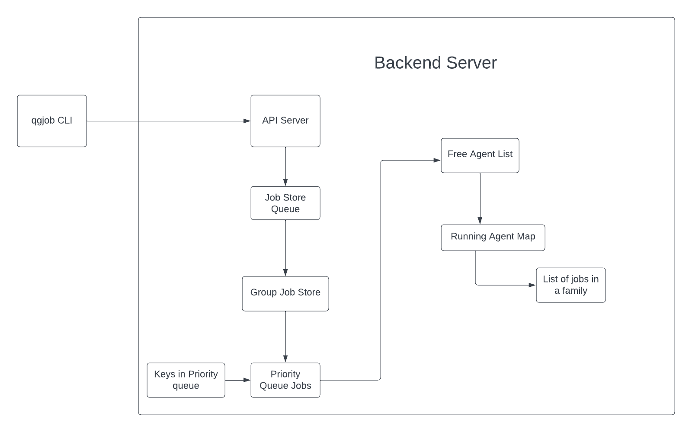

# Qualgent Job Orchestrator

This repository contains the complete system for submitting and processing test jobs via CLI and a backend server that handles scheduling, grouping, and agent assignment.



---

## System Design (Summary)

The `qgjob` CLI allows users to submit test jobs and query their status. Each job includes an `orgId`, `appId`, and test script path.

Submitted jobs are handled by the in-memory backend which performs the following:
- Stores the job data and assigns a unique job ID
- Groups jobs by a `familyKey = orgId + appId`
- Maintains a `Group Job Queue` to accumulate jobs of the same family
- Uses a `Priority Queue` to track familyKeys ready for assignment
- Ensures no duplicate keys using a `KeySet`
- Checks if an agent is already processing a family — if so, appends the job to that agent’s queue
- If no agent is working on it and one is free, assigns the job group to that agent
- Agents execute jobs sequentially and return to the free list upon completion
- New jobs that arrive mid-execution are re-queued when the agent finishes

---

## Folder Structure

- `cli/` — A command-line interface tool for submitting and checking the status of jobs.
- `backend/` — The job orchestration server with in-memory stores for jobs, agents, and queues.

---

## Getting Started

### 1. Clone the Repository

```bash
git clone https://github.com/your-username/qualgent-backend-challenge.git
cd qualgent-backend-challenge
```

---

## Backend Setup

### Prerequisites
- Node.js >= 18
- npm

### Steps

```bash
cd backend
npm install
npm start
```

The backend server should now be running on `http://localhost:3000`.

---

## CLI Setup

### Prerequisites
- Node.js >= 18
- npm

### Steps

```bash
cd cli
npm install
npm link   # This registers the CLI tool globally as `qgjob`
```

### Example Usage

```bash
qgjob submit --org-id=qualgent --app-version-id=xyz123 --test=tests/onboarding.spec.js
qgjob status --id=<job-id>
```

---

## Architecture Overview

1. **Job Submission**:
   - CLI sends the job data to the backend via REST API.

2. **Job Grouping & Queuing**:
   - The backend groups jobs based on `org_id` and `app_version_id`.
   - Grouped jobs are pushed into a priority queue if not already queued.

3. **Agent Assignment**:
   - Agents are registered and available to take jobs.
   - Jobs are dispatched based on agent availability and grouping.

4. **Job Tracking**:
   - The backend stores status for each job.
   - CLI queries this status using job ID.

---

## Development Notes

- The backend uses in-memory stores and queues which can be replaced by Redis for production-grade systems.
- Priority-based scheduling and grouping prevent starvation and enable fair resource utilization.
- Agents simulate execution but can be replaced by real workers in future iterations.
